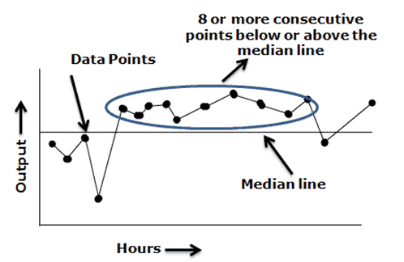
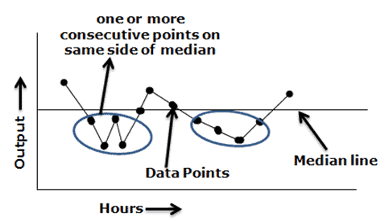
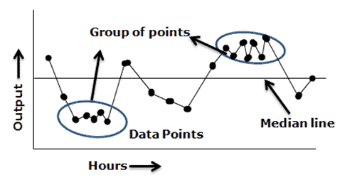
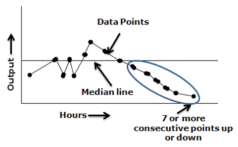
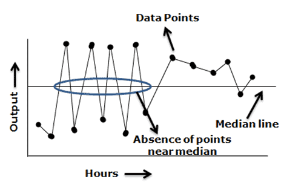
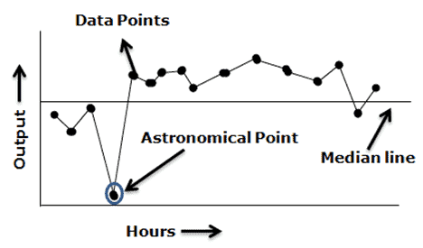
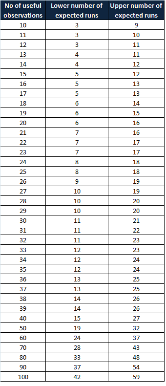

# Run Chart

A run chart is a line chart of data plotted over time. In other words, a run chart graphically depicts the process performance or data values in time order. Viewing data over time gives a more accurate conclusion rather than just summary statistics.

A run chart is also known as a trend chart or a time series plot. Usually, run charts are used in the measure phase of the DMAIC project and it helps to identify trends or shifts in the process and allows testing for randomness in the process.
Difference between Run chart and control chart

Control charts are used to monitor the stability of the process. In other words, they measure any type of output variable over time. The goal is to see the results consistently fall within the control limits. On the control chart, both upper and control limits are defined. Typically, control limits are defined as three standard deviations from the mean. If the results fall within the control limits, then the process is stable; otherwise, it suggests that the process is not stable.

A run chart is similar to a control chart, but the key difference is it can reveal shifts and trends, not the process stability. Since the run chart does not have control limits, it cannot detect out-of-control conditions. However, it will graphically depict how the process is running. You can turn a run chart into a control chart by adding upper and lower control limits. A pattern or trend indicates the presence of special cause variation in the process.
### Why use a run chart

A run chart is used to determine whether or not the central tendency of the process is changing. Following are a few reasons to use a run chart

- Easy to construct
- It does not require too many calculations or software’ for analysis.
- Easy to interpret the results
- Minimum statistical knowledge is sufficient to draw and interpret the chart

### When to use run charts

- To visually depict how the process is performing
- Effectively track and communicate improvements (and determine success)
- To identify process variation and avoid unbiased actions
- Display outputs to look for stability or instability

### Key components of Run Chart

- Time- series: the specific time period of the output (hours, days, weeks, months); plotted on the horizontal (X) axis
- Output: The data measurement from the completed process; plotted on the vertical (Y) axis
- Data points: output values plotted on the chart
- Median line: the line on the graph that shows the average of all the output measure.

### Run chart interpretation rules

The following paragraphs are the run chart decision rules used to avoid inaccurate analysis and initiate appropriate improvement actions:

  

Shift: – Seven or eight values in succession above or below the median line is a shift. Do not consider the points that fall on the median line as they are not toward or against the shift. A shift indicates a dramatic change in the process.

  

Runs – Too many or too few runs in the data displayed on the chart. In other words, one or more consecutive points are all lying on the same side of the line. Ignore the points exactly on the line!

  

Clustering – Too few runs or groups of points in one or more areas of the plot. It indicates measurement or sampling problems.

  

Trend – Seven or more consecutive points are increasing or decreasing. A basic rule of thumb is when a run chart exhibits seven or eight points successively up or down, then a trend is clearly present in the data and needs process improvement. This rule does not care whether the consecutive points are above, below, or crossing the median.

  

Mixtures – Too many runs in a chart with absences of points near the median line.

  

Astronomical Point – Astronomical points occur when there is one value that is very different from the other data values on the chart. It would be a value that is highly unlikely to occur again and would appear as an outlier.

### Counting Run Chart

A non-random pattern is signaled by too few or too many runs, or crossings of the median line. A run is a series of points in a row on one side of the median. In other words, one or more consecutive points are all lying on the same side of the line. If only chance is influencing the process being measured with a run chart, then there should be a regularity at which data points go above and below the median to satisfy this condition. Some points can fall exactly on the median line, which makes it hard to decide which run these points belong to. Hence, ignore if the value is exactly on the median line.

To apply the above-mentioned interpretation of the rules, we first need to identify the useful values/observations in the data set. This can be achieved by counting the number of runs and avoiding the values on the median line.

If you observe a greater or fewer number of runs than expected in the chart, that means there is a non-random pattern in the process. Swed and Eisenhart developed a chart in 1943 to determine the minimum and the maximum number of runs required for each data point to follow the random variation in the process. In other words, no special cause existed in the process.
### Swed and Eisenhart chart

  

### How to create run chart

- Determine the data to be measured
- Obtain the data – collect a minimum of 10 to 15 data points in a time sequence.
- Plot a graph with a time sequence in the horizontal x-axis (like, hours, days, weeks) and a vertical y-axis with measuring variables.
- Plot the data values in a time sequence
- Compute the mean/median and draw a horizontal line in the graph
- Analyze the graph, and observe the trends and patterns to detect special cause variation in the process

