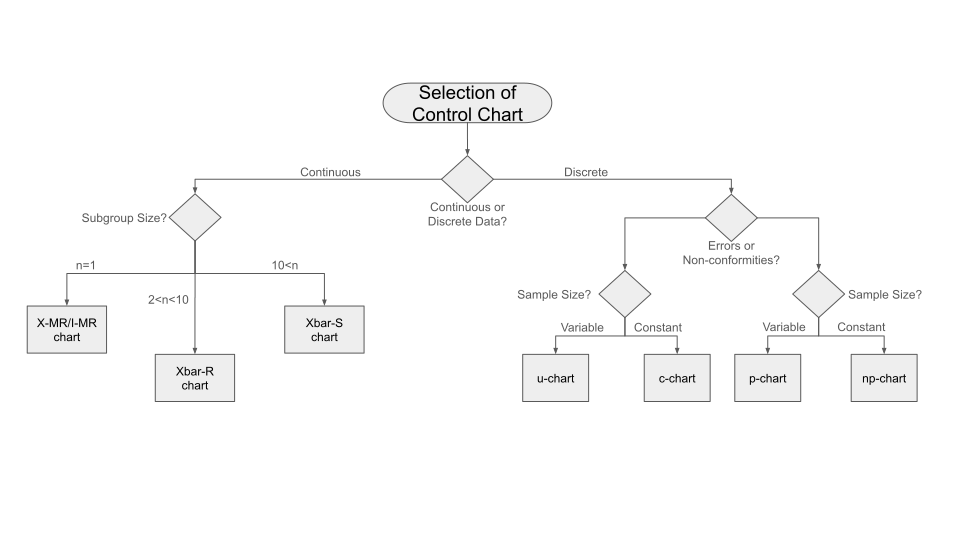

# SPC Decision Tool Guide

Creating a decision tool or guide for navigating through the decision logic flow to determine the appropriate type of control chart for your data in the context of Statistical Process Control (SPC) is a great idea. Below is a simplified guide that incorporates the decision logic for data type classification and further links each to a corresponding type of control chart. This tool aims to streamline the process from data classification to the selection of the appropriate SPC chart.  

---
    1. Identify the Data Type and Nature
        Qualitative (Categorical) Data: Typically relates to defectives. Move to Step 2.
        Quantitative (Numerical) Data: Can relate to either defects or defectives. Move to Step 3.

    2. For Qualitative Data (Defectives)
        Nominal Data:
            P-chart or NP-chart: Used for monitoring the proportion or number of defective units in a sample.
        Ordinal Data: Less common, but if applicable, adapt a P-chart or U-chart based on context.

    3. For Quantitative Data
        Determine if the focus is on Defects or Defectives:
            Attribute Data (Defectives):
                P-chart or NP-chart: For defectives, when you're interested in the proportion or count of nonconforming units.
            Attribute Data (Defects):
                C-chart or U-chart: For defects, when monitoring the count of defects per unit or nonconformities per unit of measure.
            Variable Data (Can be related to both, but often involves measurements indicative of defects):
                I-MR Chart: For individual measurements, suitable when data points are independent and come from a variable process.
                X̄-R Chart: For small sample sizes (2-10), when you want to monitor the process mean and variability.
                X̄-S Chart: For larger sample sizes (>10), better for accurately capturing the distribution of data.

### Decision Logic Flowchart 

    Start: Determine if your focus is on the quality of the unit (defective) or the quantity/quality of the issues (defects).
    Qualitative Data (Defectives):
        Nominal: ➜ P-chart or NP-chart
        Ordinal: Context-based ➜ Adapt P-chart or U-chart
    Quantitative Data:
        For Defectives: ➜ P-chart or NP-chart
        For Defects: ➜ C-chart or U-chart
        Variable Data (Consider the nature of the measurement and focus):
            ➜ I-MR Chart, X̄-R Chart, or X̄-S Chart based on sample size and analysis needs.

### Implementing the Guide

This guide can be implemented as a flowchart, a decision-making tool in software, or even a simple checklist. For digital implementation, interactive tools or apps can provide prompts based on user input, leading to the recommended control chart type, complete with explanations and examples.
Conclusion

By following this guide, you can systematically determine the right type of control chart for your specific data type and scenario in statistical process control. Whether you're dealing with qualitative or quantitative data, discrete or continuous, there's a structured path to follow that ensures you select the most appropriate SPC tool for your needs.

---
### Industry Adaptations of Defect Terminology for SPC

In non-manufacturing contexts, the terms "defects" and "defectives" might not always resonate or be applicable. Depending on the nature of the work or the industry, you might find it more relevant to use terms that reflect the quality or performance issues more closely related to your specific area. Here are some alternative terms that can be used in various non-manufacturing contexts:

- **Errors and Nonconformities:** This terminology can be suitable for software development, data processing, and administrative tasks, where "errors" refer to specific mistakes or issues in a process or output, and "nonconformities" refer to instances that do not meet the set standards or expectations.

- **Issues and Incidents:** In service industries, such as healthcare, hospitality, or IT services, "issues" can refer to specific problems encountered, while "incidents" might denote service disruptions or failure to meet service standards.

- **Variations and Non-compliances:** In fields such as finance, legal, and regulatory compliance, "variations" can denote deviations from standard procedures or expected results, and "non-compliances" refer to failures to adhere to laws, regulations, or internal policies.

- **Anomalies and Exceptions:** For data analysis, cybersecurity, and research, "anomalies" could be unusual patterns or outliers in data, while "exceptions" are cases that fall outside of normal operational parameters.

- **Faults and Failures:** In engineering and IT, "faults" might be used to describe defects in design or function, whereas "failures" denote a complete breakdown or inability to perform a required function.

Incorporating these terms into the decision tool involves adjusting the language to better suit the context of your work while maintaining the underlying logic of the tool. For example:

    Qualitative Data (Nonconformities/Incidents):
        Nominal Data:
            P-chart or NP-chart: Used for monitoring the proportion or number of nonconforming units or incidents in a sample.
    Quantitative Data (Errors/Issues):
        Attribute Data (Nonconformities/Incidents):
            P-chart or NP-chart: For monitoring the proportion or count of nonconforming units or incidents.
        Attribute Data (Errors/Issues):
            C-chart or U-chart: For monitoring the count of issues or errors per unit or per unit of measure.

This adjusted terminology ensures the decision tool is relevant and understandable across various industries, enhancing its utility and applicability outside of traditional manufacturing environments.
